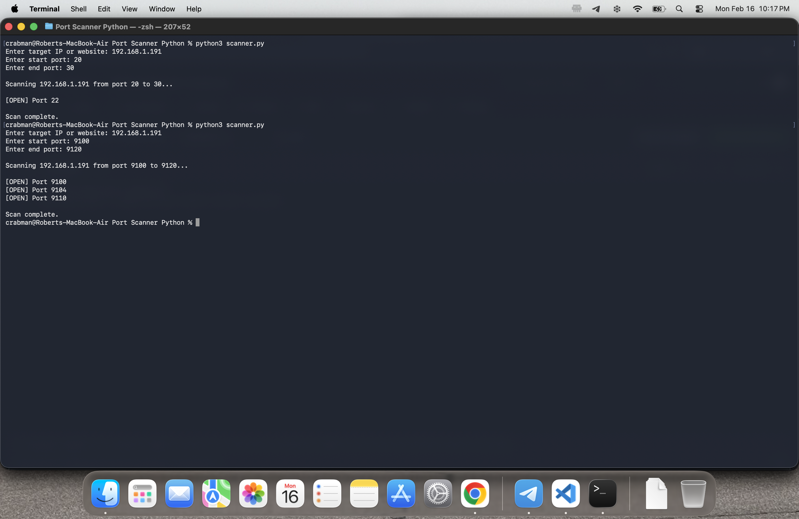

# FatBoy721 – Crabcore Port Scanner 🦀
## Project Overview

A basic TCP port scanner written in Python to explore/learn socket programming, TCP connections and port states.

## How It Works

The scanner uses a TCP socket to connect to every port in the given range that the user has given. When the TCP handshake is successful, it responds back as open if its not it won't display. The scanner also uses a timeout mechannism to prevent filtered from causing the scan to get stuck.

## Example 1 - Basic Range Scan

I scanned my local lab machine showing that SSH (port 22) is detected as open.

## Example 2 - Multiple Service Detection

Scanned my lab again showing that it has the ability to detect multiple active services I host.

## Example 3 - Error Handling

Basic input validation is included to handle invalid inputs. Typing letters where port numbers are expected to be wont crash the program and prompt the user a error message.

## What I Learned Overall

- How TCP connect scans work and how the TCP handshake determines if a port is open.
- The difference between open and filtered ports.
- Basic exception handling and input validation in Python.
- Learning how to use Python's socket module to create TCP connections.

## Credit/Ideas

This project was inspired by [CarterPerez-dev's Cybersecurity-Projects repository](https://github.com/CarterPerez-dev/Cybersecurity-Projects).
Also a video I watched on sockets. [Tech With Tim](https://www.youtube.com/watch?v=3QiPPX-KeSc)

  
